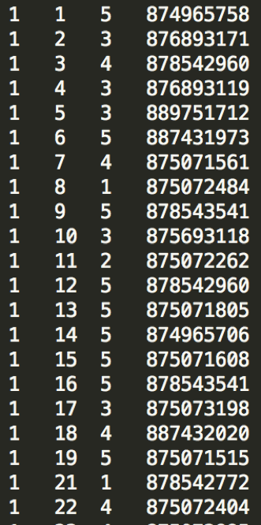
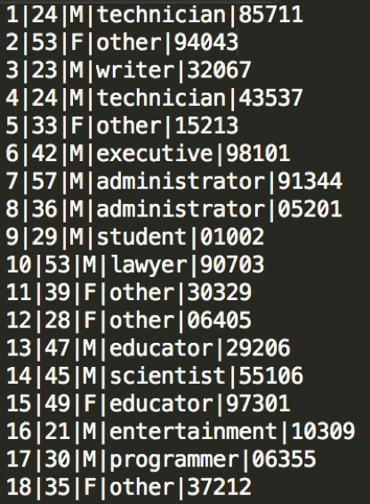
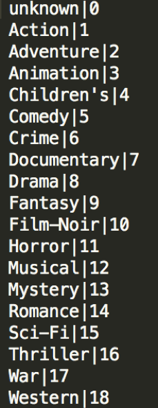
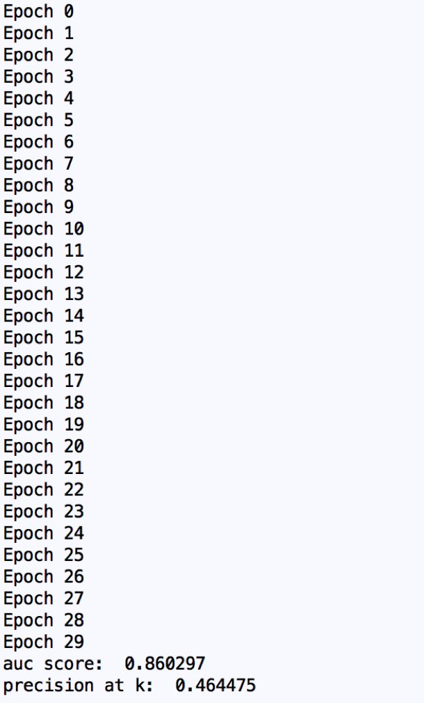
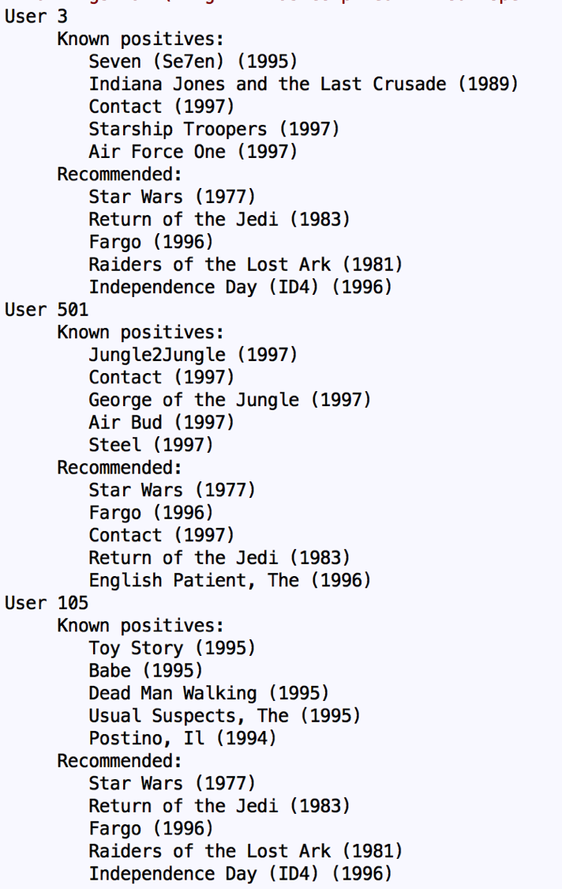

# LightFm-Recommendation
## Uses LightFm model for recommendation
https://github.com/lyst/lightfm

### LightFm is a hybrid recommendation using both collaborative filtering and Contentbased filtering
### We will be using the MovieLens 100k Dataset, and further improved the accuracy of the model by implementing users features

#The DataSet
### The DataSet includes 943 users and 1380 movies with aroudn 100k user reviews.
### User ratings

# User Details 

# Genre

# Training 
### We uses Weight Approximately Ranked Pairwise Lose (WARP) as the training objective
### Using 30 epochs and with a learning Rate of 0.05
### The training Time is aorund 10 Seconds

#Results

# Sample Recommendation
### Considered User features and product features as well as collaborative filtering
### Implemeneted user featuers such as age groups and Gender

